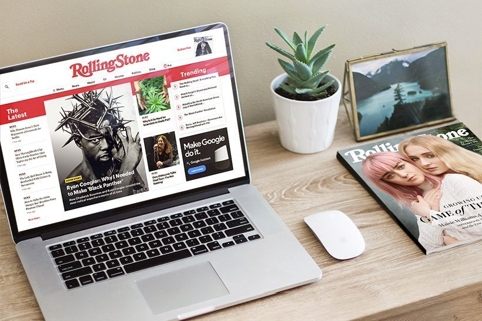

# Digitale Studio

Een modern en responsief portfolio voor een fictief digitaal bureau. Dit project demonstreert het gebruik van HTML, CSS (met Flexbox), responsief design en UX/UI-principes.

## 🚀 Demo



---

## 🛠️ Gebruikte technologieën

- HTML5
- CSS3 (met variabelen en Flexbox)
- Aangepaste typografie (Google Fonts)
- Modulaire en semantische structuur

---

## 📁 Projectstructuur

```
📦 digitale-studio/
├── assets/              # Afbeeldingen, iconen en grafieken
├── index.html           # Hoofdpagina
├── styles.css           # Hoofd stylesheet
├── .gitignore           # Bestanden en mappen genegeerd door Git
├── README.md            # Documentatie van het project
```

---

## 📷 Belangrijkste secties

- **Hero Sectie:** Hoofdboodschap met call-to-action en visuele scheiding.
- **Intro Sectie:** Korte introductie en missie van het bureau.
- **Projecten Sectie:** Cases en visueel portfolio (bv. Rolling Stone, Variety, Worth).
- **Diensten Sectie:** Serviceblokken met iconen en beschrijvingen.
- **Contact Sectie:** Formulier om berichten te versturen.
- **Footer:** Voettekst met juridische informatie.

---

## 💻 Hoe uitvoeren

1. Clone deze repository:

```bash
git clone https://github.com/jouw-ToniSSilva/digitale-studio.git
```

2. Navigeer naar de map en open `index.html` in je browser, of gebruik de **Live Server** extensie in VS Code voor realtime weergave.

---

## 📬 Contact

Gemaakt door: **Antonio da Silva**  
📧 E-mail: [sr-sill@hotmail.com](mailto:sr-sill@hotmail.com)  
🔗 LinkedIn: [linkedin.com/in/antonio-da-silva-30530246](https://linkedin.com/in/antonio-da-silva-30530246/)

---

## 📄 Licentie

Dit project is uitsluitend voor educatieve doeleinden. © NOVI Hogeschool 2025.

---

# 🌐 English Version

## Digitale Studio

A modern, responsive portfolio website for a fictional digital agency. This project showcases the use of HTML, CSS (with Flexbox), responsive design, and UX/UI principles.

## 🚀 Demo


## 🛠️ Technologies Used

- HTML5
- CSS3 (with variables and Flexbox)
- Custom typography (Google Fonts)
- Modular and semantic structure

## 📁 Project Structure

```
📦 digitale-studio/
├── assets/              # Images, icons, and graphics
├── index.html           # Main page
├── styles.css           # Main stylesheet
├── .gitignore           # Git ignored files and folders
├── README.md            # Project documentation
```

## 📷 Main Sections

- **Hero Section:** Main message with call-to-action and visual separators
- **Intro Section:** Brief introduction and agency mission
- **Projects Section:** Case studies and visual portfolio (e.g., Rolling Stone, Variety, Worth)
- **Services Section:** Service tiles with icons and descriptions
- **Contact Section:** Form to send a message
- **Footer:** Legal and ownership info

## 💻 How to Run

1. Clone the repository:

```bash
git clone https://github.com/jouw-ToniSSilva/digitale-studio.git
```

2. Navigate into the folder and open `index.html` in your browser, or use the **Live Server** extension in VS Code for live preview.

## 📬 Contact

Created by: **Antonio da Silva**  
📧 Email: [sr-sill@hotmail.com](mailto:sr-sill@hotmail.com)  
🔗 LinkedIn: [linkedin.com/in/antonio-da-silva-30530246](https://linkedin.com/in/antonio-da-silva-30530246/)

## 📄 License

This project is for educational purposes only. © NOVI Hogeschool 2025.
